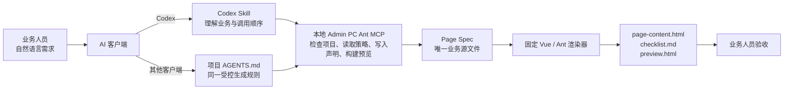

# 老板管账后台原型 PoC

这是一个受控的企业后台原型生产框架。业务人员提供自然语言需求，AI 负责理解为
Page Spec；固定 Vue / Ant Design Vue 运行层负责生成可交互的内容区和预览。

它不是“让 AI 直接写 HTML”的工具，也不是一组只靠提示词约束的模板。

## 当前状态

已完成：

- 固定 PC Shell、菜单、TopBar、Tabs 和预览注入。
- Vue 3 + Ant Design Vue 4 的固定页面运行层，以及列表内新增表单抽屉和只读详情抽屉闭环。
- `form` 与 `list` 的 Page Spec v2、声明式渲染、静态校验和一键构建。
- 独立 OpenDesign 项目的初始化与可移植预览构建。
- MCP 服务：支持本地命令型 `stdio` 接入，也支持仅监听 `127.0.0.1` 的 HTTP 本地网关。
- 十七个可构建通用 POC：四类表单、五类列表（统计含标准/富两种变体）、四类详情和三类结果页，覆盖当前已映射的 Vue/Ant 能力。

尚未完成：

- 完整 Ant 组件的语义映射与视觉模板基线。
- DatePicker、Cascader、TreeSelect、复杂条件显隐、嵌套分组、上传错误行下载、详情独立编辑流和长期处理报告。
- 详情、结果、复杂分组与上传复核 POC 的视觉和交互人工验收，以及表单/列表视觉基线冻结。
- Feature Pack 的 Vue/Ant 批量生成、回归样例库和团队治理流程。

## 核心架构

```text
业务自然语言需求
        ↓
AI 读取 Core + 一个页面族 Context Pack
        ↓
Page Spec v2（唯一可信业务产物）
        ↓
固定 Vue / Ant 渲染器
        ↓
page-content.html + checklist.md + preview.html
        ↓
用户进行视觉与交互验收
```

### MCP、Skill 与项目规则的分工

本框架不是“只有一个 MCP”或“只有一份 Skill”。MCP 是实际执行受控生成的本地服务；
Skill 和项目级 `AGENTS.md` 是给不同 AI 客户端的使用规则，避免 AI 绕过服务直接手写页面。



| 层 | 职责 | 不负责 |
| --- | --- | --- |
| 本地 MCP | 执行项目检查、策略读取、Page Spec 写入和受控构建 | 理解模糊业务需求、手写页面 |
| Codex Skill | 将业务需求转为正确的 MCP 调用流程 | 渲染 HTML、Vue 或 CSS |
| 项目 `AGENTS.md` | 给 Kimi、Cursor、Claude Code 等客户端提供同一套项目内规则 | 替代 MCP 执行构建 |
| 固定渲染器 | 从 Page Spec 稳定生成 Vue/Ant 预览 | 接收任意页面级脚本或样式 |

因此，业务人员只需选择已初始化的项目并描述业务；不需要知道 MCP、Skill、模板、组件或
构建命令。

Page Spec 是源文件；其余三份文件都是可重复生成的派生产物。AI 不得手写
页面级 Vue、JavaScript、CSS、HTML 控件或 Shell。

## 固定边界

| 层 | 负责内容 |
| --- | --- |
| 业务人员 | 目标、字段、业务规则、流程、验收标准和参考图 |
| AI | 理解需求、选择页面族、写 Page Spec v2 |
| Context Pack | 能力选择、语义组件选择、合法组合与禁止项 |
| 渲染器 | Page Spec 到 Vue/Ant 组件的确定性映射 |
| Design System | Token、主题、页面布局、Shell 与共享视觉语言 |
| 用户 | 在 `preview.html` 中验收视觉和真实交互 |

新页面没有旧 HTML 回退路径。未被当前渲染器支持的能力必须先进入框架建设，不能用
静态控件、局部脚本或 CSS 伪造。

## 当前支持面

完整 Ant Design Vue 已作为框架依赖安装；但为保证生成稳定，Page Spec 目前只能使用
经过验证的语义映射。

| 页面族 | 当前支持 | 当前不支持，需先扩展渲染器 |
| --- | --- | --- |
| `form` | 单列、Steps、侧插图、互斥录入 Tabs、Upload、上传复核表与结果流、复杂信息分组 Card、2/3/4 列字段网格、底部悬停操作栏；`static`、`input`、`select`、`radio`、字段校验、Modal | DatePicker、Cascader、TreeSelect、独立表单 Drawer、复杂条件显隐、嵌套分组、上传错误行下载、独立结果页 |
| `list` | 基础/高级查询、Input/Select/日期范围与快捷日期、行内摘要、3-5 张标准/富统计卡、平铺表格、父表展开子表、链接/标签/状态/金额列、固定操作列、Popconfirm、多选与批量操作、工具栏、导出/刷新/列设置、分页；列表内新增表单抽屉、本地新增记录和只读详情抽屉 | 树形行、嵌套展开、服务端分页/跨页全选、Cascader/TreeSelect 等复杂筛选控件 |
| `detail` | POC 待人工验收：Modal 快速核对、Drawer 查看、Anchor 长详情、Tabs 独立分组、Descriptions、Badge、只读内嵌 Table | 复杂编辑流、嵌套详情、详情内查询/分页/批量操作 |
| `result` | POC 待人工验收：基础成功/失败、摘要结果、可选满意度调研 | 长期处理报告、错误行下载、结果页内复杂操作 |

支持矩阵由工具强制校验，不能只依赖提示词。

## 使用方式

### 1. 安装与构建框架

```bash
npm install
npm run build:vue-ant-runtime
```

### 2. 初始化新的 OpenDesign 项目

在新的、可写的 Design Files 项目中使用
[初始化提示词](prompts/initialize-opendesign-project.md)。初始化只需每个产品/平台一次。

初始化完成后，项目内会拥有固定运行资源；“关联本地代码”本身不能替代这一步。

### 3. 从自然语言生成页面

将 [快速业务需求入口](prompts/business-requirement-fast-entry.md) 连同业务 PRD 交给
OpenDesign。AI 只写 `page-spec.yaml`，再运行固定命令生成另外三份产物：

```bash
node tools/build-vue-ant-page.mjs \
  outputs/features/<feature>/<page>/page-spec.yaml \
  outputs/features/<feature>/<page>/page-content.html \
  outputs/features/<feature>/<page>/checklist.md \
  outputs/features/<feature>/<page>/preview.html
```

构建失败就是阻断，不能报告预览已完成。

### 4. 通过 MCP 使用

MCP 服务适合 Codex、Claude、Cursor 或其他支持 MCP 工具调用的 AI。它不负责理解自然语言，调用它的 AI 负责读取契约并编写业务 Page Spec。

本地命令型 `stdio` 接入：

```bash
npm run mcp:serve
```

本地 HTTP 网关接入：

```bash
npm run mcp:gateway
```

网关固定监听 `http://127.0.0.1:4318/mcp`，可被支持 Streamable HTTP MCP 的本地客户端复用。HTTP 工具使用登记过的 `projectId`，不接受任意本地目录路径；项目登记、客户端配置和调用顺序见 [mcp/README.md](mcp/README.md)。

业务人员日常使用、本机 PoC 配置、Codex/Cursor/Claude Code 适配和后续分发方案见[本地 MCP 使用与分发指南](docs/local-mcp-usage-and-distribution.md)。
业务人员可直接参考[后台原型使用指南](docs/business-user-guide.md)和[已验收能力与回归提示词](prompts/acceptance-baseline.md)。

## POC 验证页

### 表单模板

- [单阶段信息收集表单](qa/vue-ant-poc/form-single-stage/preview.html) `form.single-stage`
- [分组配置表单](qa/vue-ant-poc/form-complex-groups/preview.html) `form.grouped-configuration`
- [分阶段配置表单](qa/vue-ant-poc/change-settler/preview.html) `form.staged-configuration`
- [导入复核流程表单](qa/vue-ant-poc/form-upload-flow/preview.html) `form.import-review-flow`

### 详情、结果与列表模板
- [弹窗快速详情](qa/vue-ant-poc/detail-quick-modal/preview.html)
- [抽屉关联详情](qa/vue-ant-poc/detail-drawer-record/preview.html)
- [锚点长详情](qa/vue-ant-poc/detail-anchors/preview.html)
- [标签与指标详情](qa/vue-ant-poc/detail-tabs-metrics/preview.html)
- [基础成功结果](qa/vue-ant-poc/result-basic-feedback/preview.html)
- [摘要成功结果](qa/vue-ant-poc/result-summary/preview.html)
- [失败结果](qa/vue-ant-poc/result-error/preview.html)
- [列表 + 简单操作](qa/vue-ant-poc/list-simple-operations/preview.html)
- [列表复杂用法](qa/vue-ant-poc/list-complex-operations/preview.html)
- [标准统计列表](qa/vue-ant-poc/list-statistics-standard/preview.html)
- [富统计列表](qa/vue-ant-poc/list-statistics-rich/preview.html)
- [批量操作列表](qa/vue-ant-poc/list-batch-operations/preview.html)
- [父表展开子表列表](qa/vue-ant-poc/list-expand-child-table/preview.html)
- [列表内新增与详情抽屉](qa/vue-ant-poc/list-drawer-workflow/preview.html)

对应的 Page Spec、内容区、检查清单和预览均位于同一目录，作为首批回归样例。

### 业务回归样例

- [分账规则管理](qa/business-regression/settlement-rule-management/preview.html)

业务回归样例用于确认真实 PRD 的渲染，不属于通用模板分类。

## 验证命令

```bash
npm run build:vue-ant-runtime
npm run test:mcp
npm run test:mcp:http
node tools/build-vue-ant-page.mjs <spec> <content> <checklist> <preview>
```

`test:mcp` 与 `test:mcp:http` 分别覆盖命令型 MCP 和本地 HTTP MCP。两者都会在临时目录中完成项目初始化、读取契约、写入 Page Spec 和构建四份产物，不进行浏览器视觉评判。

## 目录说明

```text
context-packs/       页面族选择与语义能力规则
design-system/       Token、Shell 配套样式、Vue/Ant 运行资源
shell/               固定后台外壳、菜单和全局交互
tools/               初始化、Page Spec 校验、渲染与预览构建
mcp/                 MCP 服务与客户端接入说明
prompts/             OpenDesign 初始化与快速业务入口
qa/                  Vue/Ant POC、MCP smoke test 与后续回归样例
outputs/features/    按业务功能生成的正式页面交付物
docs/                架构契约、演进路线和治理文档
```

## 接下来

下一阶段不是无节制扩展组件，而是先由 UI 验收并冻结表单、列表、详情和结果的视觉基线；
详情与结果验收后才开放快速业务入口，再按真实业务案例逐项建设 Cascader、复杂条件显隐和上传错误处理。完整阶段、验收
门槛与角色边界见 [演进路线图](docs/evolution-roadmap.md)。
