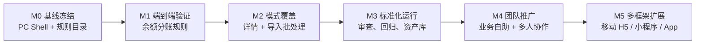

# OpenDesign 原型生产体系演进路线图

## 1. 定位与终局

本项目不是“让 AI 直接画页面”，而是一个受约束的原型生产体系：业务人员用自然语言描述需求，AI 理解为可审核的结构化规格，再在固定设计系统与 Shell 中生成高保真 HTML 内容区。

```text
自然语言需求
  -> Feature Spec / Page Spec
  -> 内容模式与局部模板
  -> page-content.html
  -> 固定 Shell 注入
  -> 产品、UI、前端审核
  -> 可交付原型与规则沉淀
```

成功的标志不是某一次页面“看起来像”，而是相似需求能稳定得到：业务正确、视觉一致、工程边界清晰、可继续迭代的产物。

## 2. 演进原则

- Shell、Design Token、组件样式属于平台资产，由 UI/前端维护，业务生成 Agent 不可改写。
- 业务需求先形成 Spec，再生成 HTML；产品不需要选择技术页面类型。
- 页面使用“骨架 + 能力 + 状态”，不为每个业务需求复制整页模板。
- 新模式先用真实需求验证，再进入目录、局部模板和 Skill；不凭截图数量堆规则。
- `page-content.html` 是长期维护资产；`preview.html` 只是固定 Shell 注入后的预览产物。
- 先稳定 PC 后台，再扩展移动端等独立 Shell；不把 PC 页面硬压缩成移动端。

## 3. 当前基线

当前已具备：

- PC 固定 Shell：菜单、TopBar、Tabs、全局工具、响应式策略。
- 设计系统：`DESIGN.md`、`tokens.css`、`components.css`。
- 双层 Spec：多页面 `feature-spec.yaml` 与单页 `page-spec.yaml`。
- 内容模式：列表、表单、详情、结果及其组合边界。
- 局部模板：查询、表格、选择态、分步表单、上传、详情分组、结果摘要等。
- 两阶段 Skill：需求拆解审核后，再批量生成内容区。
- 插图占位机制：`form.illustration` 可先占位，资产确认后替换。

当前正在验证的“余额分账规则设置”案例，是第一个端到端 Feature Pack 验证。

## 4. 里程碑路线



### M0：PC 基线冻结

目标：固定 Shell 和设计系统不再随每个业务需求漂移。

完成条件：

- Shell 的菜单、Tabs、TopBar、响应式和常用交互经过 UI 确认。
- `DESIGN.md`、Token、组件样式有唯一维护入口。
- 内容模式目录、四类页面规则、局部模板与两个 Skill 一致。
- 任何生成页面都只输出 `#page-content`。

本阶段不做：移动端 Shell、复杂权限系统、真实后端数据接入。

### M1：端到端 Feature Pack 验证

验证案例：余额分账规则设置。

覆盖能力：高级查询、指标摘要、表格状态、批量选择、危险操作确认、三步表单、插图占位、结果反馈。

完成条件：

- OpenDesign 先正确产出可审核的页面清单和 `feature-spec.yaml`。
- 确认后能按页面输出 `page-spec.yaml` 与 `page-content.html`。
- 注入固定 Shell 后，菜单、标签与业务内容边界正确。
- 产品能看懂流程，UI 能接受组合和视觉，前端能继续维护 HTML。
- 修改一处业务字段或流程时，不需要重新生成 Shell。

判定：通过后，核心架构成立；不通过时优先修正规则、Spec 或局部模板，不用靠增加长提示词掩盖问题。

### M2：模式覆盖验证

目标：证明体系不是只适用于“列表 + 新增”。

必须补齐两个真实案例：

| 案例 | 要验证的能力 | 通过标准 |
| --- | --- | --- |
| 详情与查看 | 分组字段、跨列长文本、内嵌表格、锚点或区段标签、列表打开标签 | Agent 能正确选择锚点或区段标签，不混用；详情与列表职责清楚。 |
| 导入/批处理 | 上传、文件校验、错误明细、确认、结果摘要 | 流程完整闭环，失败结果可返回处理，结果不错误创建独立菜单。 |

建议再增加一个轻量编辑案例，用于验证 `modal`、`drawer` 与独立页面的选择是否稳定。

完成条件：列表、表单、详情、结果四类骨架均至少由一个真实业务案例验证通过。

### M3：标准化运行

目标：从“AI 试验”进入可重复的团队流程。

需要建设：

- 模式准入：新模式须有真实需求、Page Spec、UI 审核和至少一个回归样例。
- 审核清单：产品审核 Feature Spec，UI 审核模式与视觉，前端审核结构和交互边界。
- 回归样例库：保留每类页面的标准输入、Feature Spec、Page Spec、预期 `page-content.html` 和截图。
- 资产库：Logo、图标、插图、空状态素材按语义命名；OpenDesign 生成资产先进入待审核区。
- 规则版本：每次修改 Shell、Token、模式或 Skill，都记录版本和受影响的样例。

建议的质量门槛：

| 环节 | 必须通过 |
| --- | --- |
| 需求拆解 | 页面、菜单、入口、路由、流转、假设完整。 |
| Page Spec | `family`、`presentation`、`capabilities`、`states` 完整且组合合法。 |
| HTML 生成 | 只包含内容区，使用既有 Token/组件类，状态可表达。 |
| 预览 | 固定 Shell 注入成功，无重复菜单、TopBar、Tabs。 |
| 人工审核 | 产品、UI、前端分别确认后才进入交付目录。 |

### M4：团队推广

目标：让业务人员在受控流程中自助发起原型需求，而不是让每个人各自维护 Prompt。

推荐工作流：

1. 产品在 OpenDesign 输入自然语言需求与参考图。
2. 需求理解 Agent 输出 Feature Spec，产品确认。
3. 生成 Agent 输出内容区和预览。
4. UI 审核视觉、模式与资产，前端审核结构和交互。
5. 通过后将 Feature Pack 作为交付物归档，新增通用经验回流至模式库。

角色边界：

| 角色 | 负责 | 不负责 |
| --- | --- | --- |
| 产品 | 业务目标、字段、规则、流程、验收 | 手选页面技术类型、手写 HTML |
| UI | 视觉基线、模式组合、资产与例外审核 | 为每个页面重画 Shell |
| 前端 | Shell、组件、可运行交互、预览工具 | 根据业务需求随意改设计规则 |
| AI / OpenDesign | 解析需求、生成 Spec 与内容区、执行自检 | 自行修改平台资产或跳过审核 |
| Codex | 维护规则、模板、Shell、验证工具和回归资产 | 替代业务规则确认 |

完成条件：产品可独立发起需求，且绝大多数需求只需审核与小范围修订；常见页面不依赖人工从零画原型。

### M5：多框架扩展

目标：以相同治理模式支持多个端，但不复用不合适的页面结构。

建议目录演进：

```text
platforms/
  admin-pc/
    design-system/
    shell/
    templates/
    skills/
    specs/
  mobile-h5/
    design-system/
    shell/
    templates/
    skills/
    specs/
  mini-program/
  app-native/
shared/
  business-vocabulary/
  asset-registry/
  qa-contracts/
```

可共享的是业务词汇、Feature Spec 的通用部分、资产登记和审核机制；不能直接共享的是 Shell、布局密度、导航和交互模板。

## 5. 资产演进

资产分为三类：

| 类型 | 当前策略 | 后续策略 |
| --- | --- | --- |
| 品牌资产 | 使用已确认 Logo | 固定版本、不可由业务生成覆盖。 |
| 功能图标 | 使用已确认图标库与语义映射 | 将图标语义写入菜单/组件规则，替换仅由 UI 审核。 |
| 业务插图 | `placeholder` 占位 | OpenDesign 生成 -> UI 审核 -> 资产库登记 -> 页面引用。 |

插图生成请求至少包含：`assetKey`、用途、目标页面、主题、色彩限制、尺寸比例、是否可复用。不能直接把生成图片散落在各个 Feature Pack 中。

## 6. 指标与风险

建议从 M3 开始记录以下指标：

- 首次 Feature Spec 被产品确认的比例。
- 一次生成后 UI 只需内容修改、不需改 Shell/视觉基线的比例。
- 每个 Feature Pack 的人工修改次数与原因。
- 新增模式被后续需求复用的次数。
- 生成页面违反 Shell 边界、遗漏状态、错误组合的次数。

主要风险与控制：

| 风险 | 控制方式 |
| --- | --- |
| 规则越写越长，Agent 不稳定 | 用 Spec 和局部模板承载结构；提示词只负责调度。 |
| 业务特殊性逼迫复制模板 | 先判断是否为新能力，再加入模式目录，不复制整页。 |
| Shell 被生成内容侵入 | 生成前后检查 `#page-content` 边界，预览只走注入工具。 |
| 插图风格失控 | 先占位，生成后由 UI 审核并登记资产。 |
| 多端扩展过早 | PC 四类骨架验证完成前，不建立第二套完整框架。 |

## 7. 当前建议的下一步

1. 用余额分账规则设置需求完成 M1 验证，并记录实际问题归因到需求、Spec、模式、模板或 Shell。
2. 验证详情与导入/批处理两个真实案例，完成 M2。
3. 将三组通过案例冻结为回归样例，开始 M3 的模式准入与审核流程。
4. 在 M3 稳定后，再讨论目录迁移到 `platforms/admin-pc/` 与移动端框架。
